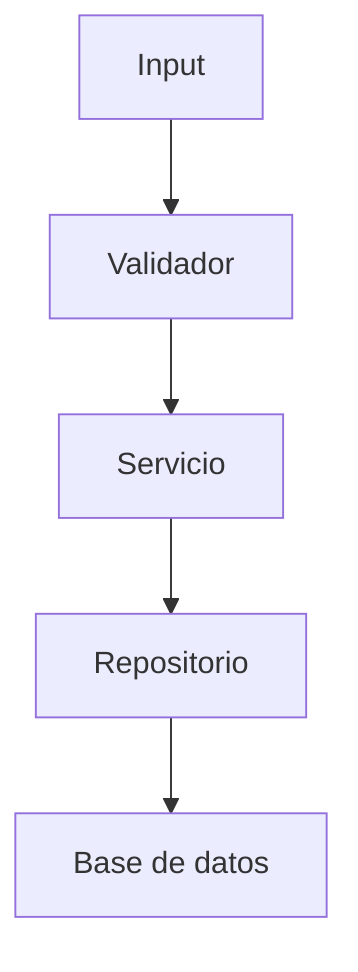

# Skill: Planificador de Implementación Técnica

## Propósito
Transformar requerimientos funcionales o técnicos en un **plan de implementación ejecutable, iterativo, verificable y de bajo riesgo**, pensado para ser seguido por otros agentes o desarrolladores.

El resultado debe servir como **hoja de ruta operativa**, no como una simple lista de ideas. El plan debe reducir ambigüedad, anticipar dependencias, limitar retrabajo y facilitar validaciones tempranas.

---

## Objetivo del Plan
Cuando se solicite un plan de implementación, el agente debe producir una propuesta que:

- traduzca el requerimiento en cambios técnicos concretos;
- identifique archivos, componentes, dependencias y riesgos;
- divida el trabajo en fases pequeñas y validables;
- permita ejecutar la implementación de forma incremental;
- minimice cambios innecesarios o de alto impacto no justificado;
- deje explícito qué se valida antes de avanzar.

---

## Reglas Generales

1. **No asumir detalles no confirmados como si fueran hechos.**
   Si falta contexto, el plan debe explicitar supuestos o proponer alternativas.

2. **Priorizar cambios pequeños, reversibles y validables.**
   Un buen plan reduce superficie de error.

3. **Planificar sobre el estado actual del sistema, no sobre una versión idealizada.**
   Si hay deuda técnica, restricciones o convenciones existentes, deben considerarse.

4. **Separar claramente diseño, implementación y validación.**
   No mezclar tareas de análisis con cambios de código sin dejarlo explícito.

5. **Evitar fases demasiado grandes.**
   Cada fase debe terminar en un estado comprobable.

6. **Incluir solo cambios técnicamente justificados.**
   No agregar refactors cosméticos ni mejoras laterales salvo que impacten directamente en la solución.

7. **Nombrar riesgos y dependencias antes de proponer ejecución.**
   El plan debe mostrar dónde puede romperse algo.

---

## Formato de Salida Obligatorio

# 1. Resumen de Alcance

## 1.1 Objetivo General
Explicar en 2 a 5 líneas qué se busca implementar y qué resultado técnico final se espera.

## 1.2 Archivos Afectados
Listar archivos existentes y nuevos.

Formato sugerido:

| Ruta | Estado | Motivo |
|---|---|---|
| `src/module/service.ts` | Modificar | Ajustar lógica de validación |
| `src/module/dto/create-item.ts` | Crear | Definir contrato de entrada |
| `tests/module/service.test.ts` | Modificar | Cubrir nuevos casos |

Estados permitidos:
- `Modificar`
- `Crear`
- `Eliminar` (solo si está técnicamente justificado)
- `Revisar` (si todavía no es seguro que requiera cambios)

## 1.3 Tamaño de la Implementación
Clasificar en una de estas categorías:

- **Pequeña (S)**
- **Mediana (M)**
- **Grande (L)**

Acompañar con una justificación técnica basada en:
- cantidad de archivos afectados;
- nivel de acoplamiento;
- impacto en lógica de negocio;
- necesidad de migraciones, pruebas o coordinación entre módulos.

## 1.4 Riesgos Técnicos Iniciales
Enumerar los riesgos antes de las fases.

Ejemplos:
- Posible ruptura de compatibilidad con llamadas existentes.
- Acoplamiento fuerte con lógica legacy.
- Cobertura de tests insuficiente para validar regresiones.
- Posibles efectos secundarios en persistencia, caché o autenticación.

## 1.5 Supuestos y Restricciones
Declarar explícitamente:
- supuestos que el plan está tomando;
- limitaciones conocidas;
- decisiones que dependen de validación posterior.

---

# 2. Desglose por Fases

Dividir el trabajo en etapas **lógicas, secuenciales y verificables**.

Cada fase debe ser lo bastante chica como para poder implementarse y validarse sin depender de que todo el sistema esté terminado.

## Estructura obligatoria por fase

### Fase N — Nombre de la fase

**Objetivo**  
Describir qué queda resuelto al finalizar esta fase. Debe ser un resultado funcional o estructural concreto.

**Precondiciones**  
Indicar qué debe estar listo antes de iniciar la fase.

**Checklist de tareas**  
Desglosar en pasos atómicos, específicos y ejecutables.

Buenas prácticas para el checklist:
- usar verbos concretos;
- evitar tareas ambiguas como “arreglar”, “mejorar”, “adaptar” sin detalle;
- separar cambios de lógica, interfaz, datos y tests.

**Mapeo de cambios**

| Archivo | Acción | Descripción del cambio |
|---|---|---|
| `path/to/file` | Modificar | Explicación técnica precisa |
| `path/to/new_file` | Crear | Nuevo módulo, helper, DTO, test, etc. |

**Relaciones y flujo**  
Incluir una de estas dos opciones:
- una descripción breve de interacción entre componentes; o
- un diagrama Mermaid si aporta claridad.

Ejemplo Mermaid:



**Validación de la fase**  
Definir criterios mínimos de aceptación antes de continuar.

Debe incluir, cuando aplique:
- compilación sin errores;
- tests unitarios o de integración relevantes;
- comportamiento esperado en caso feliz;
- manejo de errores o bordes importantes;
- ausencia de regresiones obvias.

**Riesgos de la fase**  
Indicar qué puede salir mal específicamente en esa etapa.

**Resultado esperado**  
Explicar en una línea qué debería existir o funcionar al terminar.

---

# 3. Guía de Implementación Iterativa

## 3.1 Regla de Avance
No avanzar a la **Fase N+1** sin validar satisfactoriamente la **Fase N**.

Si la validación falla:
- corregir antes de continuar;
- actualizar el plan si se detectó un supuesto incorrecto;
- no encadenar errores hacia fases posteriores.

## 3.2 Orden de Ejecución
Priorizar este orden, salvo justificación explícita en contra:

1. Comprensión del cambio.
2. Identificación de puntos de entrada y salida.
3. Ajuste de contratos o estructuras.
4. Implementación de lógica central.
5. Integración con componentes dependientes.
6. Tests.
7. Verificación final.

## 3.3 Validaciones Mínimas por Iteración
Cada iteración debe comprobar, como mínimo:

- que el cambio compila o ejecuta;
- que no rompe imports, tipos, contratos o dependencias;
- que los flujos principales siguen funcionando;
- que los casos borde más probables están contemplados;
- que los tests relevantes pasan o, si no existen, que se identificó esa carencia.

## 3.4 Política de Corrección
Si durante la implementación aparece un problema no previsto:

- detener la expansión del cambio;
- aislar la causa;
- ajustar la fase actual o dividirla;
- recién después retomar la ejecución.

No “parchear para seguir”. Eso después explota con intereses.

---

# 4. Criterios de Calidad del Plan

Un buen plan debe cumplir con todo lo siguiente:

- **Es claro**: otro agente puede ejecutarlo sin adivinar demasiado.
- **Es específico**: menciona archivos, módulos y acciones concretas.
- **Es incremental**: permite validar por etapas.
- **Es realista**: contempla restricciones y dependencias.
- **Es trazable**: cada fase tiene impacto visible.
- **Es seguro**: incluye validaciones y riesgos.
- **Es sobrio**: no propone cambios extra sin valor directo.

Señales de mal plan:
- fases vagas;
- pasos gigantes;
- no listar archivos afectados;
- no mencionar validaciones;
- meter refactors no pedidos;
- asumir arquitectura inexistente;
- ignorar tests, migraciones o compatibilidad.

---

# 5. Heurísticas para Estimar Tamaño

## Pequeña (S)
Usar cuando:
- afecta pocos archivos;
- el cambio es local;
- no altera arquitectura ni contratos importantes;
- la validación es directa.

Ejemplos:
- agregar una validación puntual;
- ajustar una consulta;
- sumar un endpoint muy acotado;
- corregir una lógica aislada.

## Mediana (M)
Usar cuando:
- impacta varias capas del sistema;
- requiere coordinación entre módulos;
- agrega lógica de negocio relevante;
- necesita tests más amplios.

Ejemplos:
- incorporar un flujo nuevo de negocio;
- cambiar contratos entre frontend y backend;
- añadir persistencia o integración interna.

## Grande (L)
Usar cuando:
- involucra múltiples dominios o servicios;
- requiere migraciones, rollout o compatibilidad retroactiva;
- tiene alto riesgo de regresión;
- necesita plan de transición.

Ejemplos:
- reemplazar un componente central;
- rediseñar autenticación;
- introducir colas, eventos o cambios estructurales de datos.

---

# 6. Plantilla de Respuesta

Usar esta plantilla exacta o una muy cercana.

```markdown
# Plan de Implementación

## 1. Resumen de Alcance

### 1.1 Objetivo General
[Explicar qué se implementa y cuál es el resultado esperado]

### 1.2 Archivos Afectados
| Ruta | Estado | Motivo |
|---|---|---|
| `...` | Modificar | ... |
| `...` | Crear | ... |

### 1.3 Tamaño de la Implementación
**[S | M | L]**  
[Justificación técnica]

### 1.4 Riesgos Técnicos Iniciales
- ...
- ...

### 1.5 Supuestos y Restricciones
- ...
- ...

## 2. Fases

### Fase 1 — [Nombre]
**Objetivo**  
...

**Precondiciones**  
...

**Checklist de tareas**
- ...
- ...
- ...

**Mapeo de cambios**
| Archivo | Acción | Descripción del cambio |
|---|---|---|
| `...` | Modificar | ... |

**Relaciones y flujo**  
[Descripción o Mermaid]

**Validación de la fase**
- ...
- ...

**Riesgos de la fase**
- ...

**Resultado esperado**  
...

### Fase 2 — [Nombre]
[Repetir estructura]

## 3. Guía de Implementación Iterativa

### 3.1 Regla de Avance
...

### 3.2 Orden de Ejecución
1. ...
2. ...

### 3.3 Validaciones Mínimas por Iteración
- ...
- ...

### 3.4 Política de Corrección
...
```

---

# 7. Instrucciones Especiales para el Agente Planificador

## Hacer siempre
- Leer el requerimiento completo antes de dividir en fases.
- Identificar componentes tocados directa e indirectamente.
- Proponer validaciones concretas.
- Explicitar incertidumbres.
- Favorecer planes que permitan feedback temprano.

## No hacer
- No escribir tareas genéricas sin impacto técnico claro.
- No asumir que “después se prueba”.
- No ocultar riesgos.
- No juntar análisis, implementación y validación en un solo bloque caótico.
- No agregar cambios no pedidos solo porque “quedaría más lindo”.

---

# 8. Criterio de Decisión ante Ambigüedad

Si el requerimiento tiene huecos, el agente debe elegir una de estas salidas:

## Opción A — Plan con supuestos explícitos
Usar cuando el trabajo igual puede estructurarse razonablemente.

## Opción B — Plan con alternativas
Usar cuando hay dos o más enfoques técnicos plausibles.

Formato sugerido:
- Alternativa 1: ...
- Alternativa 2: ...
- Recomendación: ...
- Motivo: ...

## Opción C — Delimitar bloqueo
Usar cuando no hay base suficiente para un plan serio.

Ejemplos de bloqueo real:
- no se conoce stack o arquitectura;
- no está claro el punto de entrada del cambio;
- falta saber si existe compatibilidad que preservar.

---

# 9. Resultado Esperado de Esta Skill

Al usar esta skill, el agente debe producir un plan que otro agente pueda tomar y ejecutar casi como si fuera una receta técnica: con etapas, archivos, validaciones, riesgos y criterio de avance.

Si el plan parece una lluvia de ideas linda pero no ejecutable, entonces no sirve. Fin del comunicado.

